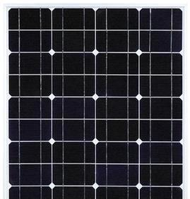
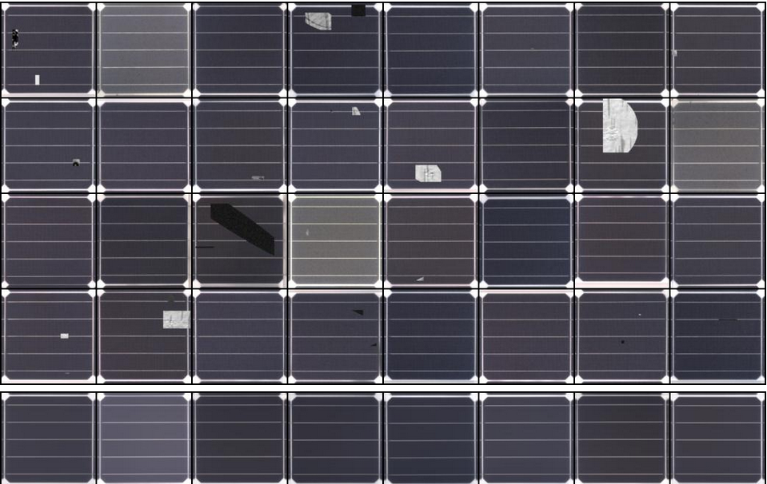
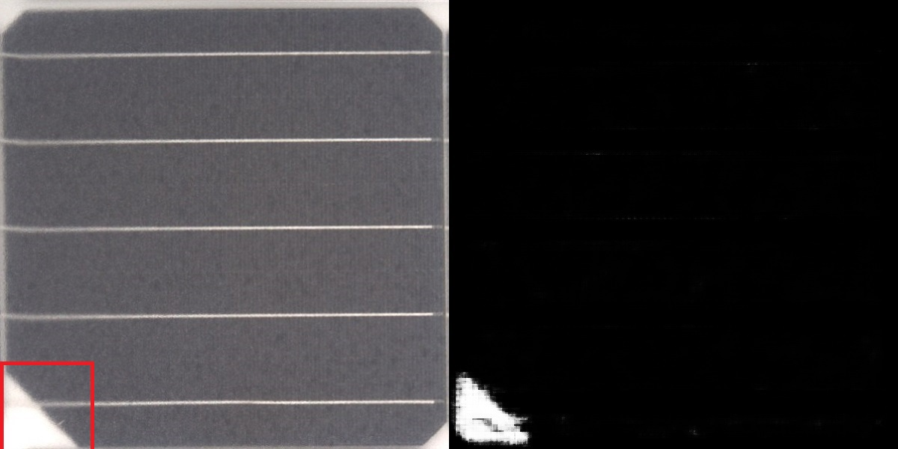
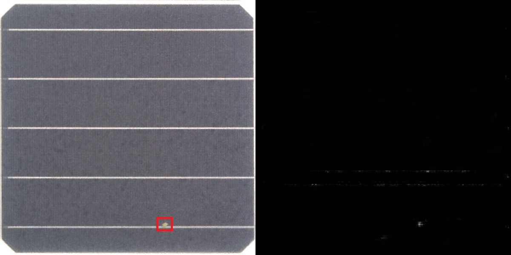
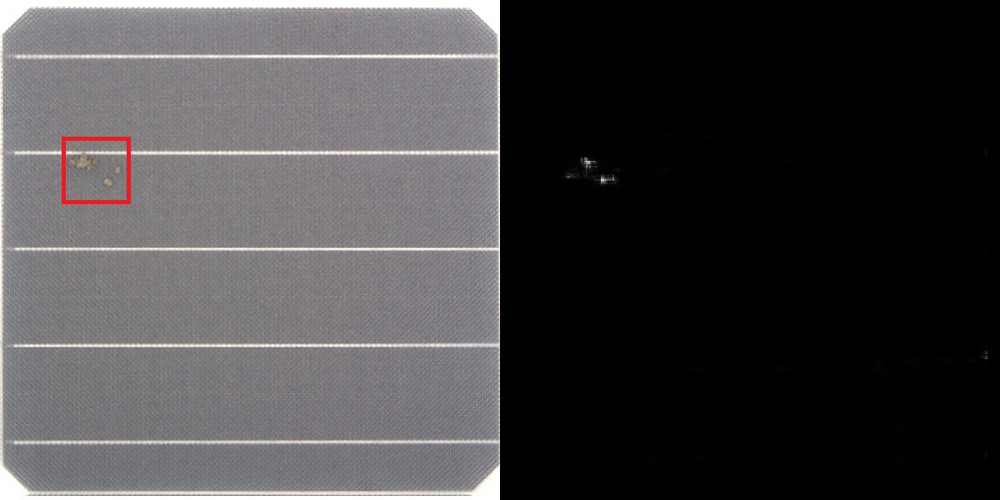
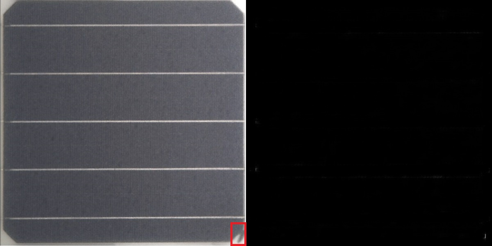
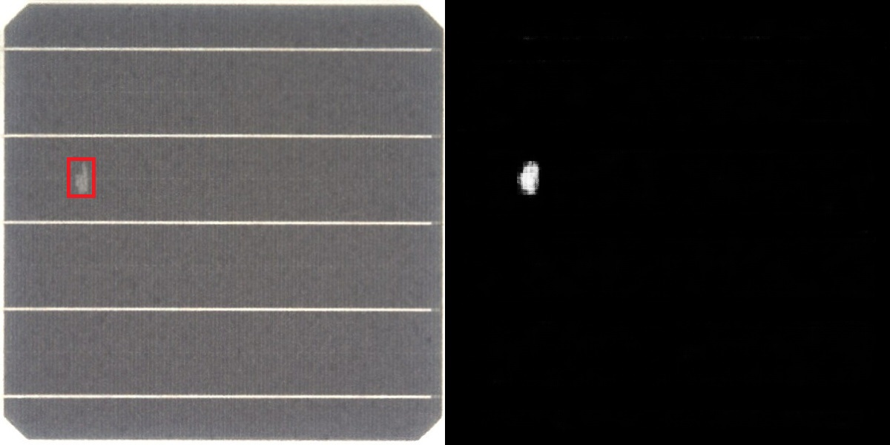

# 对光伏外观面板进行异常检测

构造人工异常样本比对学习

由于异常情况难以统计也难以获取数据标注，因此采用Change Detection方式进行检测。
采集正常的隧道壁数据，采用self-supervised learning 方式进行学习。
对正常数据随机添加不同的人造异常样本，作成pair对，其中一个是正常样本另一个是人造异常样本，双输入网络进行异常分割模式，基于contrastive learning进行训练，使得网络对异常部分具有高度敏感性。

## result

